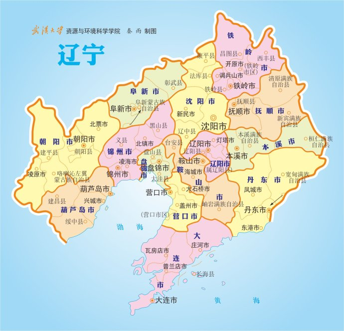
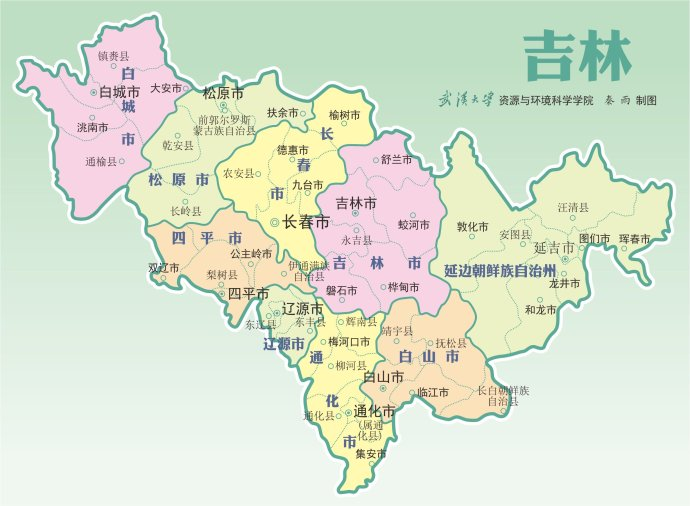

---

---

[TOC]

# 中国全图

# 历史版图
## 中古时期
### 春秋

### 战国

## 第一帝国
### 秦

### 西汉

### 东汉

### 三国

### 西晋

### 东晋

### 南北朝

## 第二帝国
### 隋

### 唐

### 五代十国

### 北宋

### 南宋

## 第三帝国
### 元

### 明

### 清

# 各省市图

## 华北
### 北京—北京—京
### 天津—天津—津

### 河北—石家庄—冀

### 山西—太原—晋

### 内蒙古--呼和浩特--蒙

## 东北
### 黑龙江—哈尔滨—黑

### 辽宁—沈阳—辽

### 吉林—长春—吉

## 华东
### 山东—济南—鲁

### 江苏—南京—苏

### 安徽—合肥—皖

### 上海—上海—沪

### 浙江—杭州—浙

### 江西—南昌—赣

### 福建—福州—闽

### 台湾—台北—台

## 华南
### 广东—广州—粤

### 广西—南宁—桂

### 海南—海口—琼

## 西南
### 云南—昆明—滇

### 贵州—贵阳—黔

### 重庆—重庆—渝

### 四川—成都—川

### 西藏—拉萨—藏

## 西北
### 陕西—西安—陕

### 宁夏—银川—宁

### 甘肃—兰州—甘

### 青海—西宁—青

### 新疆—乌鲁木齐—新

## 华中
### 河南—郑州—豫

### 湖北—武汉—鄂

### 湖南—长沙—湘

